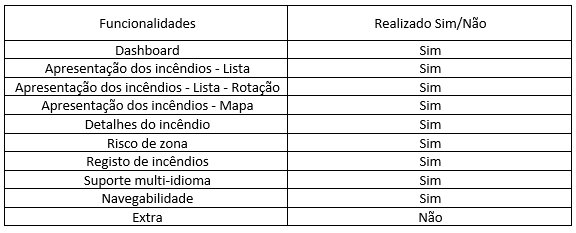
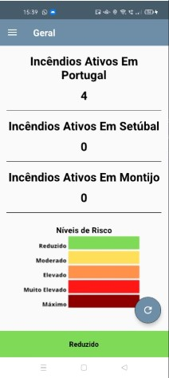
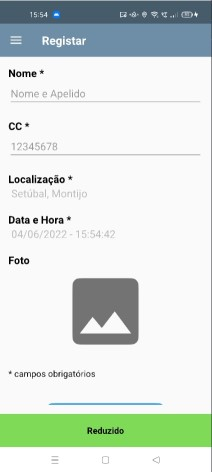
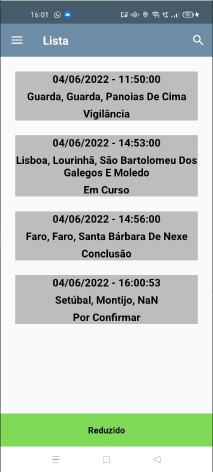

# Projeto Android Nativo - Computação Móvel

## Avaliação Final: 13

### Descrição: 
Projeto feito no âmbito da cadeira de computação móvel, tendo como objetivo criar uma aplicação móvel android nativa, para melhorar e acrescentar funcionalidades (o utilizador pode registar fogos), a aplicação já existente Fogos.pt, usando para isso a linguagem Kotlin.

## Feito por: Pedro Costa - 21904825 & Tomás Maia - 21904341

### Video: https://youtu.be/lnjgCDtQ9gE

### Funcionalidades:
#### Parte 1:

  

#### Parte 2:

  

### Screenshots:
#### DashBoard:
##### Estes valores são alterados automaticamente dependendo dos fogos registados manualmente e os da API. Os valores "Setúbal" e "Montijo" é da localização do utilizador, e não valores forçados.

  
  

##### Nota: Toda a app têm tradução automática, apenas foi desmonstrado a do dashboard para evitar a repetição de screenshots.
##### Nota 2: Enquanto mudava a linguagem do telemóvel para outra sem ser português um dos fogos foi extinto, não é erro da app.

#### Mapa:
##### Aqui no mapa temos como valor default mostrar todos os incendios do pais, mas com a ajuda de um dropdown menu podemos escolher um distrito em especifico, ampliando o mapa automaticamente e mostrando apenas os fogos desse distrito.

  
  

##### Nota: Todos os fogos são clicaveis levando para a pagina de detalhes.

#### Registar:
##### Foto 1 e 2: ecrã de registo não preenchido (foto é campo opcional, todos os outros não, o CC é obrigatorio ser tamanho 8 e só numeros)
##### Foto 3: ecrã de registo com erros
##### Foto 4: ecrã de registo preenchido

  
  

  
  

#### Lista:
##### Foto 1 e 2: ecrã da lista com os fogos da API e os registados.
##### Foto 3: Filtrando os fogos usando a pesquisa por distrito.

  

  

  

#### Detalhes:

  
  

#### Contactos:

  

##### Nota: Ao clicar em cada nome/email/foto, irá pedir para escolher qual serviço de email pertende usar, preenchendo automaticamente o campo de email, ao clicar na foto da ULHT irá abrir a página web da mesma
