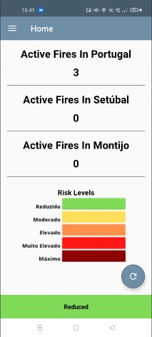
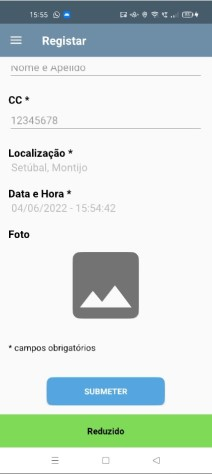
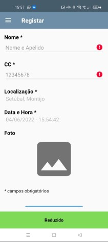

# Projeto Android Nativo - Computação Móvel 2021/2022

## Feito por: Pedro Costa - 21904825 & Tomás Maia - 21904341

### Video:

### Autoavaliação:
    - Parte 1: 17
    - Parte 2: 14

### Funcionalidades:
#### Parte 1:

  

#### Parte 2:

  

### Screenshots:
#### DashBoard:
#### Estes valores são alterados automaticamente dependendo dos fogos registados e futuramente os da API

  
  

##### Nota: Toda a app têm tradução automática, apenas foi desmonstrado a do dashboard para evitar a repetição de screenshots

#### Mapa:

  

#### Registar:
##### Foto 1 e 2: ecrã de registo não preenchido (foto é campo opcional, todos os outros não, o CC é obrigatorio ser tamanho 8 e só numeros)
##### Foto 3: ecrã de registo com erros
##### Foto 4: ecrã de registo preenchido

  
  
  
  

#### Lista:

  
  

#### Detalhes:

  
  

#### Contactos:

  

##### Nota: Ao clicar em cada nome/email/foto, irá pedir para escolher qual serviço de email pertende usar, preenchendo automaticamente o campo de email, ao clicar na foto da ULHT irá abrir a página web da mesma